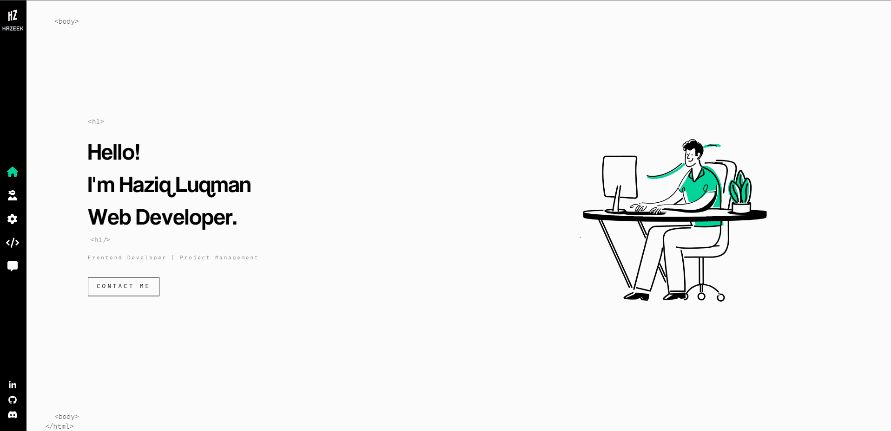

# Portfolio Project

## Table of Contents

- [Overview](#overview)
- [Built With](#built-with)
- [Features](#features)
- [Contact](#contact)
- [Acknowledgements](#acknowledgements)

## Overview

Link => [Hazeek](https://portfolio-project-hazel.vercel.app/)

The portfolio is designed to showcase my work to potential employers and collaborators.
Built using React, SASS, and Animate.CSS, this portfolio provides a clean and modern design that effectively displays my projects and skills.

By completing this portfolio, i have gained valuable experience in web development, including frontend development, user interface design, and integration of third-party libraries and APIs.

### Built With

- [React](https://beta.reactjs.org/)
- [SASS](https://sass-lang.com/documentation/)
- [Animate.CSS](https://animate.style/)
- [EmailJS](https://www.emailjs.com/docs/examples/reactjs/)
- [React Leaflet](https://react-leaflet.js.org/)
- Deployed using [Vercel](https://vercel.com/)

## Features

1. EmailJS - allowing users to easily contact me directly from the portfolio page.
2. ReactLeaflet - provide an interactive map of my location.

## Contact

- [Linkedin](https://www.linkedin.com/in/haziq-luqman-611500172/)
- [Discord](https://discordapp.com/users/260799150168211459)

## Acknowledgements

List of resource that helped me in this project.

- [EmailJS](https://www.emailjs.com/docs/examples/reactjs/)
- [React Leaflet](https://react-leaflet.js.org/)
- [Font Awesome](https://fontawesome.com/start)
- [freeCodeCamp](https://www.freecodecamp.org/)
